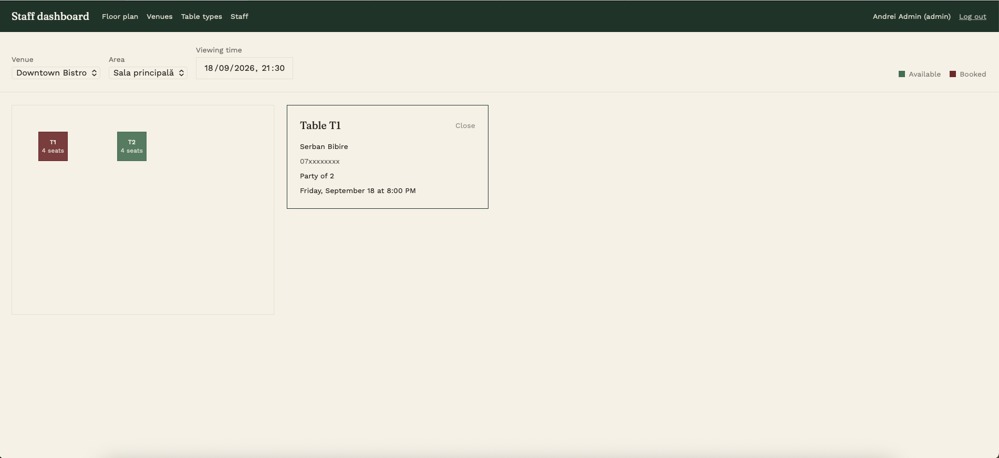
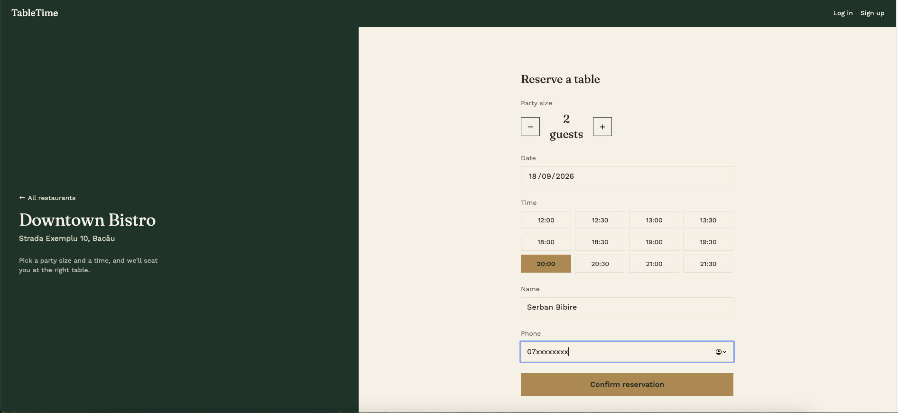

# Restaurant Booking API

A RESTful backend for a two-sided restaurant reservation platform: customers browse restaurants and book a table, while restaurant staff manage venues, floor plans, and reservations — with JWT authentication, full multi-tenant data isolation, and automated tests.

Built as a learning project to explore TypeScript, Prisma ORM (MongoDB), and building a properly authenticated, multi-tenant REST API from scratch.

## Live Demo

- **API:** https://restaurant-booking-api-ojpf.onrender.com *(free tier — the first request after a period of inactivity can take up to a minute)*
- **Frontend:** https://restaurant-booking-frontend-five.vercel.app — [source](https://github.com/SerbanB09/restaurant-booking-frontend)

| Staff floor plan | Customer booking flow |
|---|---|
|  |  |

See the [frontend repo](https://github.com/SerbanB09/restaurant-booking-frontend) for the full UI and more screenshots.

## Stack

- **Language:** TypeScript
- **Framework:** Node.js + Express
- **ORM:** Prisma (MongoDB)
- **Database:** MongoDB (local via Docker for development, MongoDB Atlas in production)
- **Auth:** JWT + bcrypt — two independent auth systems (staff and customers)
- **Validation:** Zod
- **Testing:** Jest + Supertest
- **API Testing:** Bruno (collection included in `bruno/`)

## Features

**Restaurants (staff)**
- Self-service sign-up — creates a restaurant account and its first admin user atomically
- Full CRUD for venues, areas, table types, and tables
- A live per-area floor plan endpoint: given a date/time, returns every table with its booking (if any) already resolved, so the frontend only needs to render
- Role-based staff accounts (`admin` / `member`); the account creator is a protected `owner` who can never be demoted or removed by other admins
- Every request scoped to the authenticated user's account, at every level of the hierarchy — including resources like `areas` and `tables`, which don't store `account_id` directly, checked through their parent `venue`

**Customers**
- Independent accounts, decoupled from any restaurant — register, log in, change password
- Browse every restaurant on the platform (no tenant scoping — customers aren't "in" any one restaurant's account)
- Book a table with an account, or as a guest (name + phone, no account needed)
- Booking conflict detection — the server picks an available table automatically based on party size and rejects a request if nothing fits

**General**
- Centralized error handling (`AppError` + Express error middleware) with consistent JSON error responses
- Request validation via Zod on every write endpoint
- 14 automated integration tests covering auth, account isolation, and booking conflicts

## Data Model

```
accounts
  ├── users         (account_id) — staff; roles: admin/member; one user per account is_owner
  ├── venues        (account_id)
  │     └── areas         (venue_id)
  │           └── tables        (area_id, table_type_id)
  └── table_types   (account_id)

customers  — independent of accounts; can browse and book at any venue

bookings   (venue_id, table_id, + exactly one of:
             user_id      — created by staff on the guest's behalf
             customer_id  — created by a logged-in customer
             guest_name / guest_phone — created by a guest with no account)
```

## Getting Started

**Requirements:** Node.js, Docker.

```bash
# 1. Install dependencies
npm install

# 2. Copy the env file and fill in your own JWT secret
cp .env.example .env

# 3. Start MongoDB
docker compose up -d

# 4. Generate the Prisma client
npx prisma generate

# 5. Seed the database with demo data
npm run seed

# 6. Start the dev server
npm run dev
```

The seed script creates a demo restaurant account with two staff users:

| Role   | Email             | Password      |
|--------|-------------------|----------------|
| admin  | admin@demo.com    | password123    |
| member | member@demo.com   | password123    |

It also creates a venue, an area, a table type, a table, and one booking. Customer accounts aren't seeded — register one via `POST /customers` or through the frontend.

## Authentication

There are two separate, non-interchangeable token types — a staff token can't be used on customer routes and vice versa, enforced server-side, not just by convention.

**Staff:** `POST /users/login` → JWT (1 day), carries `account_id` and `roles`.
**Customers:** `POST /customers/login` → JWT (30 days).

Send either as:
```
Authorization: Bearer <token>
```

## API Endpoints

### Staff auth & accounts
| Method | Endpoint              | Auth        | Description                                       |
|--------|------------------------|-------------|-----------------------------------------------------|
| POST   | `/users/login`         | —           | Staff log in, returns JWT                            |
| POST   | `/accounts/register`   | —           | Register a new restaurant + its first admin, atomically |
| GET    | `/accounts`            | staff       | Get your own account                                  |
| PATCH  | `/accounts/:id`        | staff       | Update your account                                    |

### Staff (team)
| Method | Endpoint        | Auth          | Description                                     |
|--------|-----------------|---------------|----------------------------------------------------|
| POST   | `/users`        | staff (admin) | Add a staff member to your account                  |
| GET    | `/users`        | staff         | List staff in your account                          |
| GET    | `/users/:id`    | staff         | Get a staff member                                  |
| PUT    | `/users/:id`    | staff         | Update a staff member (self, or any if admin)       |
| DELETE | `/users/:id`    | staff (admin) | Remove a staff member (not self, not the owner)     |

### Venues, areas, table types, tables
Standard CRUD, all scoped to the authenticated staff member's account:
```
/venues            /areas             /table_types        /tables
  POST /             POST /             POST /               POST /
  GET /              GET /              GET /                GET /
  GET /:id           GET /:id           GET /:id             GET /:id
  PATCH /:id         PATCH /:id         PATCH /:id           PATCH /:id
  DELETE /:id        DELETE /:id        DELETE /:id          DELETE /:id
```
Plus: `GET /areas/:id/floor-plan?date=<ISO datetime>` — every table in the area with its booking at that time, if any.

### Bookings (staff view)
| Method | Endpoint            | Description                                              |
|--------|---------------------|--------------------------------------------------------------|
| GET    | `/bookings`         | All bookings across every venue in your account                |
| GET    | `/bookings/:id`     | Get a booking                                                   |
| POST   | `/bookings`         | Create a booking on behalf of a guest                           |
| PATCH  | `/bookings/:id`     | Update a booking (re-checks conflicts if table/date changes)    |
| DELETE | `/bookings/:id`     | Delete a booking                                                |

### Customers
| Method | Endpoint                | Auth     | Description                    |
|--------|--------------------------|----------|----------------------------------|
| POST   | `/customers`             | —        | Register                         |
| POST   | `/customers/login`       | —        | Log in                           |
| GET    | `/customers/me`          | customer | Get your own profile             |
| PATCH  | `/customers/me`          | customer | Update your profile              |
| PATCH  | `/customers/me/password` | customer | Change password                  |

### Public (customer-facing)
| Method | Endpoint                             | Auth               | Description                                               |
|--------|----------------------------------------|--------------------|-----------------------------------------------------------|
| GET    | `/public/venues`                       | —                  | List every restaurant on the platform                       |
| GET    | `/public/venues/:venueId`              | —                  | Get one restaurant's details                                 |
| POST   | `/public/venues/:venueId/bookings`     | optional (customer) | Book a table — as a guest (`guest_name`/`guest_phone`) or, with a customer token, using your account's details |

## Testing

A Bruno collection is included under `bruno/Learning` with requests for every endpoint, including a login flow that auto-captures the JWT.

Automated tests (auth middleware, account isolation across venues/areas, booking conflict detection):
```bash
npm test
```
*Note: the customer, public, and floor-plan endpoints were added after the test suite and aren't covered yet.*

## Project Structure

```
src/
  controllers/   — request handlers, one file per resource
  routes/        — Express routers, one file per resource
  schemas/       — Zod validation schemas
  middlewares/   — staff auth, customer auth, validation, centralized error handling
  errors/        — AppError class
  manager/       — Prisma client instance
prisma/
  schema.prisma  — data model
  seed.ts        — demo data seed script
```
